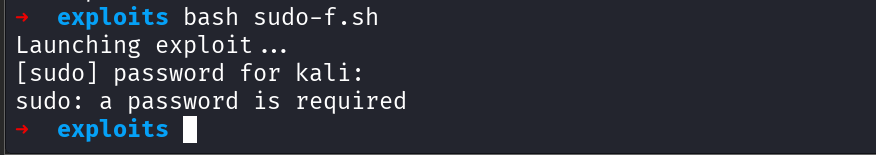
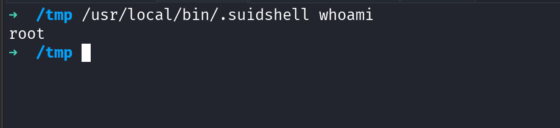

# CVE-2025-32463: Local Privilege Escalation via `sudo -R` NSS Injection

## Summary

This PoC demonstrates **local privilege escalation** on Linux systems via abuse of the `sudo -R` option in conjunction with a custom NSS module. It targets the vulnerability [**CVE-2025-32463**](https://github.com/pr0v3rbs/CVE-2025-32463_chwoot), which stems from unsafe handling of the `nsswitch.conf` and NSS shared libraries under a chroot environment.

This PoC, **`sudo2root`**, adapts the original technique by compiling a custom NSS module that leverages the `constructor` attribute to escalate privileges and drop a setuid root shell in `/usr/local/bin/.suidshell`.

---

## Vulnerability Details

- **Vulnerability**: Improper input validation and unsafe use of the `-R` chroot flag by `sudo`.
- **Impact**: A local attacker with `sudo` access can execute arbitrary code as **root**, breaking container and user isolation.
- **Root Cause**:
  - `sudo -R` changes the root directory but **does not drop privileges** or **sanitize the environment**.
  - NSS modules are loaded even from attacker-controlled paths inside this new root.
- **Exploit Strategy**:
  1. Create a fake root filesystem with malicious `nsswitch.conf` and custom `libnss_*` shared object.
  2. Trick `sudo` into loading the attacker-controlled NSS library.
  3. The shared object executes code on load (via `__attribute__((constructor))`), drops a setuid root shell, and escalates privileges.

---

## PoC Overview

### Key Components:

1. **`sudo2root.c`** – Malicious NSS module:
   - Uses a constructor function that:
     - Gains root via `setreuid(0,0)` and `setregid(0,0)`
     - Writes a small C program for a root shell
     - Compiles it with `gcc`
     - Sets correct SUID permissions

2. **Bash Exploit Script**:
   - Prepares the fake chroot with:
     - `etc/nsswitch.conf`
     - Custom `libnss_/sudo2root1337.so.2` NSS module
   - Launches the exploit via:
     ```bash
     sudo -R sudo2root sudo2root
     ```

3. **Setuid Shell**:
   - Written to: `/usr/local/bin/.suidshell`
   - Retains root on execution:
     ```bash
     /usr/local/bin/.suidshell id
     ```

---

## Usage

```bash
chmod +x sudoinject.sh
./sudoinject.sh
````

After the exploit completes, run:

```bash
/usr/local/bin/.suidshell
whoami  # => root
```

---

## File Structure

```text
sudoinject.sh                 # Main exploit script
libnss_/sudo2root1337.so.2   # Malicious NSS module (compiled)
sudo2root/etc/nsswitch.conf  # Custom nsswitch pointing to fake module
/usr/local/bin/.suidshell    # Final setuid root shell
```

---

## Technical Overview:

### Exploiting `sudo -R`:

* `sudo`’s `-R <dir>` flag changes the root directory before executing a command.
* If this directory has a custom `nsswitch.conf` with `passwd: /libnss_<name>.so`, `sudo` loads it **before dropping privileges**.
* This behavior allows arbitrary code execution as root.

### NSS Module Execution:

* Shared object is compiled with:

  ```bash
  gcc -shared -fPIC -Wl,-init,exploit_constructor -o libnss_/sudo2root1337.so.2 sudo2root.c
  ```
* Constructor runs **before** any `main()` logic.
* Creates and compiles a suid shell with:

  ```c
  setreuid(0,0); setregid(0,0); execl("/bin/bash", "bash", NULL);
  ```
* Sets permissions via:

  ```bash
  chown 0:0 .suidshell && chmod 4755 .suidshell
  ```

---

## Screenshot (PoC)




---

## Acknowledgments

* Original PoC Inspiration: [pr0v3rbs/CVE-2025-32463\_chwoot](https://github.com/pr0v3rbs/CVE-2025-32463_chwoot)
* Exploit adapted and improved by: `MikiVirus`

---

## 📢 Disclaimer

> This code is provided **for educational purposes only**. Unauthorized use of this code on systems you do not own or have explicit permission to test is **illegal** and unethical. Always get proper authorization before conducting security testing.

---

